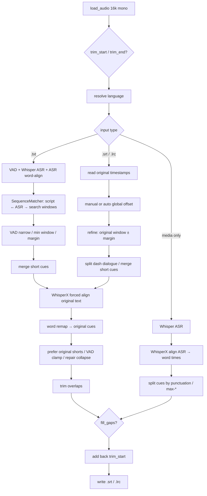

# Pipeline

Critical path for `sub-align` / `align_file()`. Strategy depends on whether a
subtitle file is passed and on its extension. There is **no translation step**:
ASR (Whisper) is used for timing anchors or to generate text when no script is
given; forced alignment always uses the text you supply when a subtitle file
exists.

## Shared skeleton

Implementation: `src/sub_align/align.py` → `align_file`.

### Shared steps

1. **Load audio** — `whisperx.load_audio` → mono float32 at 16 kHz (needs ffmpeg).
2. **Trim** — `--trim-start` / `--trim-end` drop samples before alignment; output
   times are shifted back onto the original timeline (`+ trim_start`).
3. **Language** — `--language`, or `--detect-language` (tiny Whisper).
4. **Branch** — build segments / cues (sections below).
5. **WhisperX `align`** — phoneme / wav2vec-style forced alignment → word-level
   timestamps (`return_char_alignments=False`).
6. **Postprocess** — map words onto original cues; repair thin/failed cues from
   search windows; `_trim_overlaps`; optional `_fill_gaps`; write output.

Default output names:

- With subtitle: `<stem>.aligned.<ext>` (non-`.srt`/`.lrc` output suffix becomes `.srt`)
- Audio only: `<media-stem>.asr.srt`

## Path A — media only (no subtitle)

**Goal:** create timed subtitles from speech.

1. Load Whisper `--model` and `transcribe`.
2. Forced-align ASR segments to get **word timestamps** (so sentence splits do
   not evenly stretch pauses).
3. Split into cues on strong punctuation (English `.?!;` plus `。？！；`). Optional
   `--max-words` / `--max-chars` / `--max-duration` split further for display.
4. Optional `--fill-gaps`, then write.

| Concern | Behavior |
|---------|----------|
| Full transcription? | **Yes** — ASR text *is* the output |
| Word-level align? | **Yes** — for cue boundaries |
| `--margin` / `--offset` | Not used |

## Path B — `.txt` (untimed script)

**Goal:** keep script wording; invent timestamps.

`.txt` parsing (`formats/txt.py`): one non-empty line → one cue with `start=end=0`.

1. **Energy VAD** (`vad.detect_speech_spans`) → speech islands.
2. Whisper ASR + WhisperX align of **ASR text** → timed tokens (anchors only).
3. `build_script_align_segments`:
   - `SequenceMatcher` maps script alphanumeric tokens ↔ ASR timed tokens;
   - fill unmatched cues from neighbors / audio bounds;
   - narrow oversized or unmatched fill windows onto VAD speech;
   - enforce a minimum search duration (~0.5s);
   - expand each window by `--margin`.
4. Temporarily merge very short cues (≤3 alnum tokens) with neighbors so
   forced alignment has enough context; times are remapped to original lines.
5. WhisperX forced-align with **`text = original script line`** (not ASR wording).
6. Word remap → overlap trim → optional fill-gaps.

| Concern | Behavior |
|---------|----------|
| Full transcription? | ASR runs for **timing only**; output text stays the script |
| Word-level align? | **Twice** — ASR words for windows, then script forced-align |
| `--offset` / `--no-auto-offset` | **Ignored** |

## Path C — `.srt` / `.lrc` (timed subtitles)

**Goal:** correct drift while keeping existing cue text.

Format notes:

- **SRT** — full start/end per cue (`formats/srt.py`).
- **LRC** — start tags only; end = next start (last cue ~3s or clipped to audio).
  Metadata tags like `[ti:]` / `[offset:]` are skipped; file `[offset:]` is **not**
  treated as CLI `--offset`.

1. Load cues; if trimmed, shift cue times into the trimmed coordinate system.
2. **Global offset** (one of):
   - `--offset SEC` — apply constant shift; skip auto ASR;
   - default auto — Whisper ASR → `estimate_global_offset` (median of
     `asr_start - cue.start` over token matches; needs ≥3 matches and
     `|offset| ≥ 0.25s`, else 0);
   - `--no-auto-offset` — no constant shift.
3. `assign_windows(mode="refine")` — each cue’s original span with end
   `+ --margin` and a smaller start lead-in (capped at 0.25s).
4. Multi-line dash dialogue (`-A\n-B` / `-A\n-B\n-C…`) is temporarily split into
   per-line align segments, then merged back to one cue. When no dialogue split
   occurs, very short cues (≤3 alnum tokens) are temporarily merged with
   neighbors for FA (same as `.txt`), then split back via word remapping.
5. WhisperX forced-align → word remap → prefer original short spans when FA
   collapsed → **VAD start clamp** → overlap trim → restore any zero-duration
   leftovers → postprocess.

| Concern | Behavior |
|---------|----------|
| Full transcription? | Only if auto-offset; skip with `--offset` or `--no-auto-offset` |
| Word-level align? | **Yes** for per-cue refine |
| vs ffsubsync | Optional whole-track shift **plus** independent per-cue forced align |

## Key techniques

| Piece | Role |
|-------|------|
| Whisper ASR | Timing anchors (`.txt`, auto-offset) or full transcript (audio-only) |
| Energy VAD | Narrow bad/oversized `.txt` search windows; clamp refine starts out of silence |
| `SequenceMatcher` | Token alignment script↔ASR (`.txt` windows; also offset matching) |
| WhisperX forced align | Word-level refine of supplied text against audio |
| Word remap | Map aligner words back to original cues after WhisperX splits/merges |
| Dash dialogue split | Temporary per-line FA for multi-line `-…` cues on `.srt`/`.lrc` refine |
| Short-cue merge | Temporary neighbor merge for ≤3-token cues on `.txt` and non-dialogue `.srt`/`.lrc` |

Forced alignment is **not** machine translation. If the script disagrees with
what was spoken, timestamps may still attach to the wrong audio; fix the text
or use the audio-only path.

## Code map

| Area | Location |
|------|----------|
| Entry / branches | `src/sub_align/align.py` → `align_file` |
| `.txt` windows | `build_script_align_segments`, `_assign_windows_from_asr` |
| `.srt`/`.lrc` windows | `src/sub_align/windows.py` → `assign_windows(..., mode="refine")` |
| Global offset | `estimate_global_offset` |
| Word remap | `_apply_aligned_times`, `_apply_from_words` |
| Formats | `src/sub_align/formats/{srt,lrc,txt}.py` |
| CLI | `src/sub_align/cli.py` |
